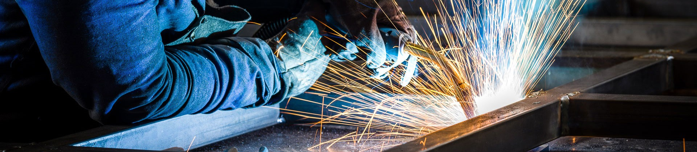
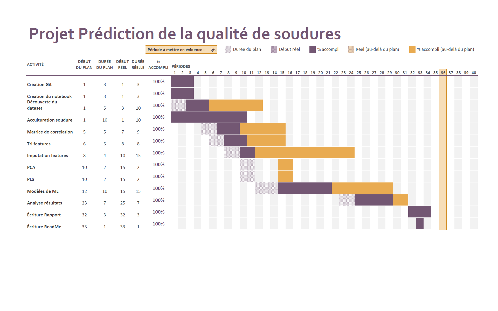

# Project *Weld quality prediction* TD3 group 3

## Introduction

In today's industrial context, the quality of welds plays a fundamental role, particularly in critical sectors such as energy (wind turbines), aerospace and shipbuilding. These industries are heavily dependent on the expertise of welders, which creates uncertainty linked to human subjectivity and the transmission of knowledge, mainly based on experience. However, with the development of artificial intelligence techniques and increasing access to data, an opportunity has arisen to capture, standardise and enrich this expertise via data analysis.

The proposed project is part of this industrial optimisation approach: it aims to predict the quality of welds based on [data from welding processes on steels](https://www.phase-trans.msm.cam.ac.uk/map/data/materials/welddb-b.html). This challenge is all the more important as it affects sectors worth several billion euros. The aim is not only to optimise production by reducing dependence on human expertise, but also to discover new patterns that could improve the quality of welds based on data mining.

## Composition of the group
- Rayane BOUAÏTA
- Erwan DAVID
- Pierre EL ANATI
- Guillaume FAYNOT
- Gabriel TRIER

## Project architecture

For maximum clarity, we have chosen to integrate all our code into a python notebook, making it easy to a

